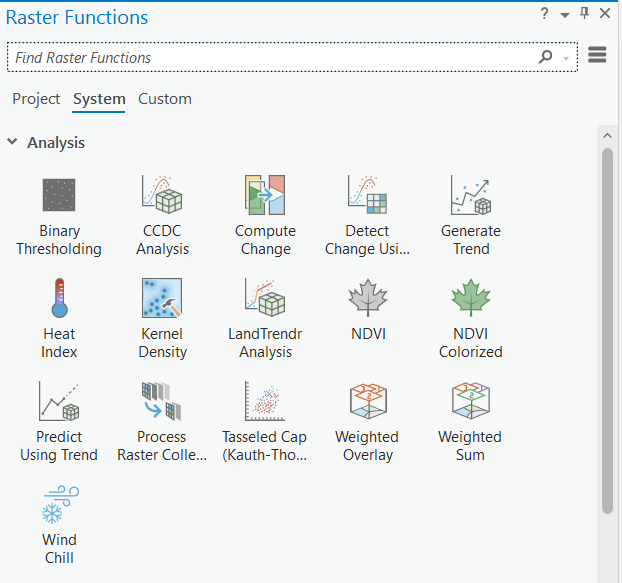

# Raster Methods

<!-- There are also many different types of manipulations we can do with raster data.  Because raster data is "simpler" we often don't need as many tools needed to accomplish all these tasks.  Rather, we often rely on stringing together multiple computations.  Many of the complex raster analyses we can do are beyond the scope of this course, but we'll cover the basics here.
 -->

[Raster Examples Project](https://github.com/June-Skeeter/Module4_GEOS270/blob/main/data/RasterMethods.zip){: .btn .btn-blue }

  <iframe src="content/RasterAnalysis.html" title="Processes" scrolling="no" frameborder="0"
    style="border: 0;
   height: 100%;
   left: 0;
   position: absolute;
   top: 0;
   width: 100%;">
   
Your browser does not support iframes.

 </iframe>

<a href="content/RasterAnalysis.html" target="_blank">View Slides in New Tab</a>

<!-- ## Parsing and Aggregating

Many times, our data is more "complex" than we need it to be.  It is often useful to parse or aggregate our data.  Other times, we have two or more datasets that we need to combine.

- [Clip](https://pro.arcgis.com/en/pro-app/latest/tool-reference/data-management/clip.htm)
	- Cuts raster down to a bounding box.  Bounding box extent can be defined by another raster layer, a vector layer, or manually.

- [Reclassify](https://pro.arcgis.com/en/pro-app/latest/tool-reference/spatial-analyst/reclassify.htm)
	- Reassign cell values, used to "condense" data or reassign values.

- [Mosaic](https://pro.arcgis.com/en/pro-app/latest/tool-reference/data-management/mosaic.htm)
	- Combine multiple raster data sets into one.  There are [multiple approaches](https://desktop.arcgis.com/en/arcmap/latest/manage-data/raster-and-images/mosaic-operators.htm) we can use.

## Overlay

Often, we have multiple data layers and we want to combine them to form a new output.  With raster data, we have a few tools we can use for this.

- [Weighted Overlay](https://desktop.arcgis.com/en/arcmap/latest/tools/spatial-analyst-toolbox/weighted-overlay.htm)
	- Combine multiple layers for suitability or risk analysis
	- Suitable alternative for the Port Alberni Tsunami Modelling

- [Raster Calculator](https://desktop.arcgis.com/en/arcmap/latest/tools/spatial-analyst-toolbox/raster-calculator.htm)
	- More general than weighted overlay, can be used to do weighted overlay if combined with reclassification.
	- Suitable alternative for the Port Alberni Tsunami Modelling

- [Zonal Statistics](https://desktop.arcgis.com/en/arcmap/latest/tools/spatial-analyst-toolbox/zonal-statistics.htm)
	- We can calculate a single statistic value (mean, max, etc.) using zones (regions) defined by and generate an output with the desired statistic by zone.  The zone can be either another raster **or** a vector layer.
	- We can also use [Zonal Statistics as Table](https://pro.arcgis.com/en/pro-app/latest/tool-reference/spatial-analyst/zonal-statistics-as-table.htm) to generate a table containing multiple statistics grouped by zone.

## Proximity Analysis

Sometimes, we're interested in looking at spatial relationships using raster data.

- [Euclidean Distance](https://desktop.arcgis.com/en/arcmap/latest/tools/spatial-analyst-toolbox/euclidean-distance.htm)
	- We can use this tool to calculate distance from the nearest feature or raster layer.  

## Surface Analysis

These tools are specifically designed to analyze terrain surfaces (ie. Digital Elevation Models), however, they can be applied to other purposes in select applications.

- [Slope](https://desktop.arcgis.com/en/arcmap/latest/tools/spatial-analyst-toolbox/slope.htm)
	- Calculates the slope of a terrain surface, ie. the angle in degrees from a cell to it's "lowest" neighbor.

- [Aspect](https://pro.arcgis.com/en/pro-app/latest/help/analysis/raster-functions/aspect-function.htm)
	- Related to slope, this tool calculates slope direction.

## Raster Functions

ArcGIS Pro has an exentsive toolkit of tools for more complex analyses you can do with raster data as well.

 -->
